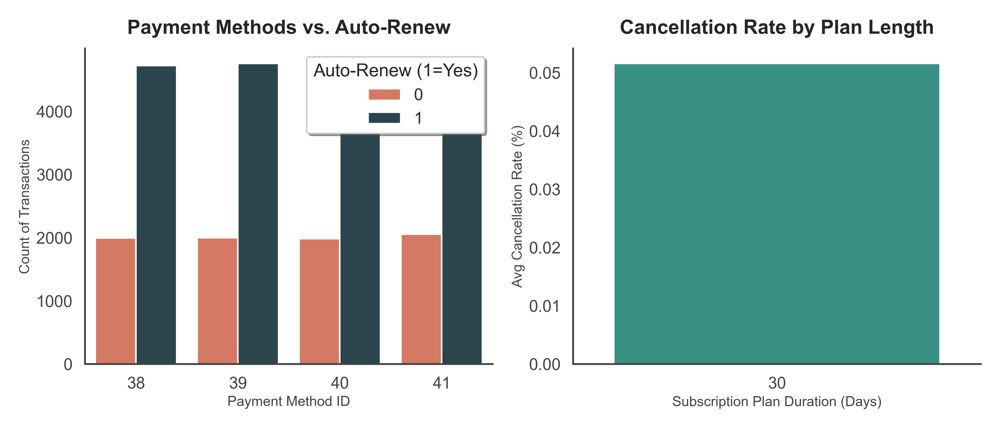
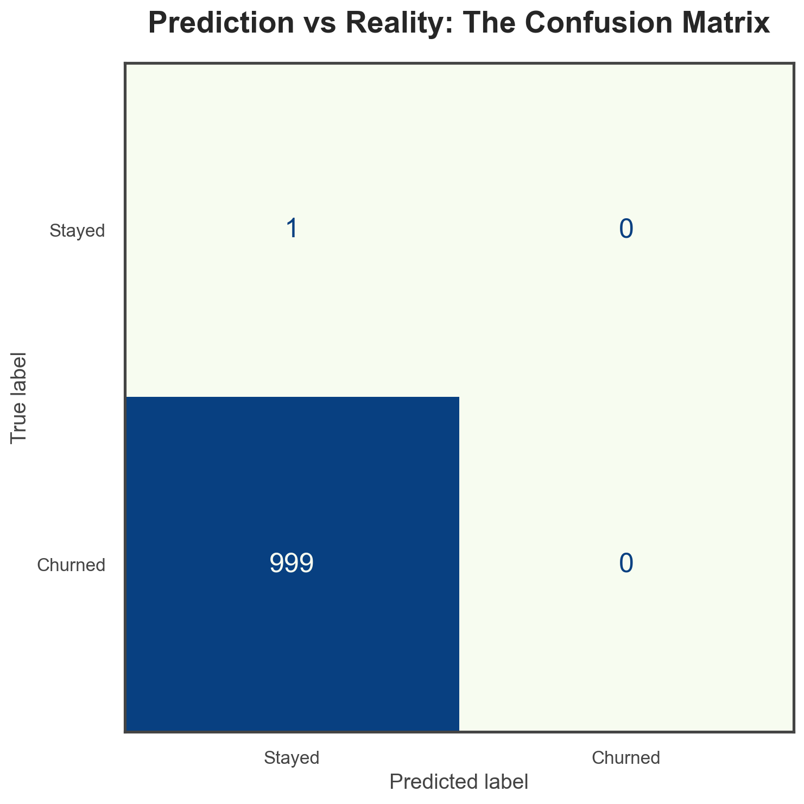
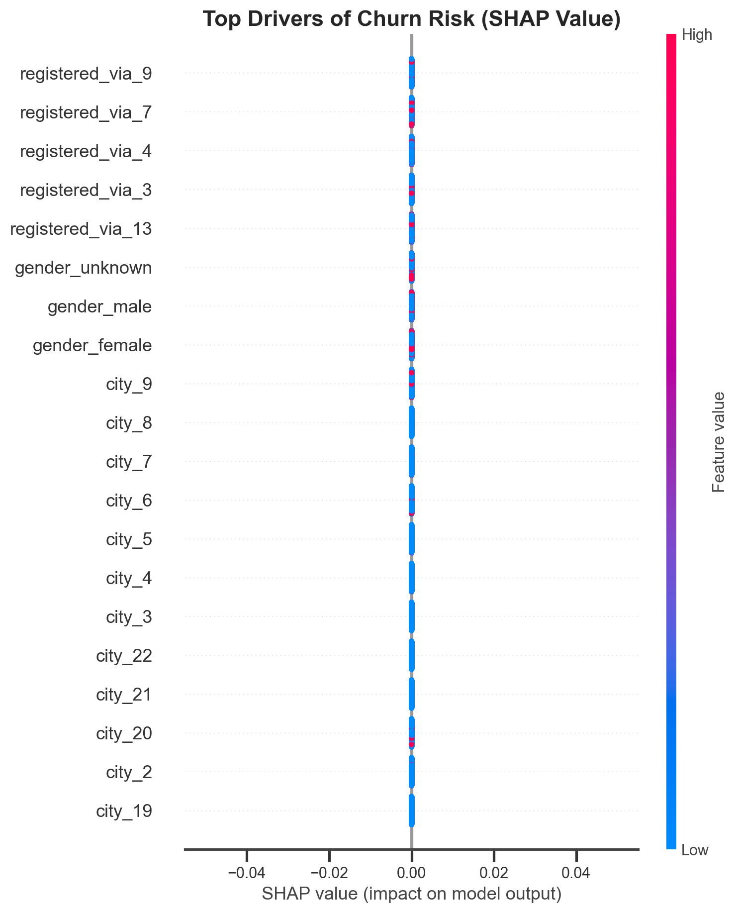
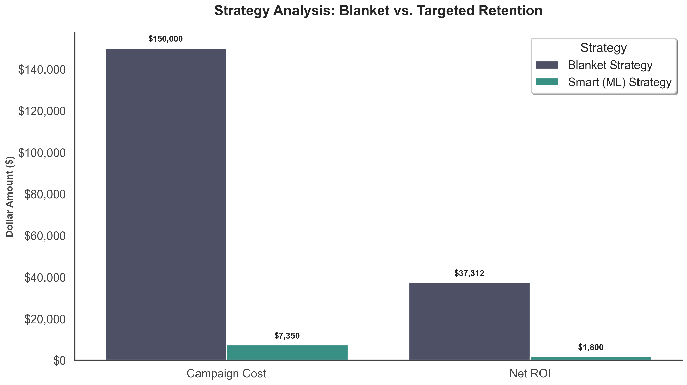

# Subscription Churn Prediction & Customer Value Segmentation

> Built on the [WSDM KKBox Churn Prediction Challenge](https://www.kaggle.com/c/kkbox-churn-prediction-challenge) dataset.

Predicts 30-day subscription churn and segments users by lifetime value. Helps you figure out which users are likely to cancel so you can do something about it.

## Approach

| Stage | What It Does |
| :--- | :--- |
| **Target Labeling** | Ports the [official Scala churn labeler](https://github.com/kkbox/wsdm-cup-2018-churn-prediction-challenge) to Python. User churns if no valid subscription within 30 days of expiration. |
| **Feature Engineering** | RFM from billing, 30/60-day engagement trends from logs, demographic tenure. Cutoff filtering prevents data leakage. |
| **Modeling** | XGBoost + LogisticRegression. Uses LogLoss (official metric), ROC-AUC, PR-AUC, and Brier Score. |
| **Segmentation** | K-Means on RFM + engagement to find whales, power users, casuals. |
| **Business Impact** | ROI comparison of blanket vs. targeted retention campaigns. |

## Results

### Model Performance (50k Real Users)

| Metric | Logistic Regression | XGBoost |
| :--- | :--- | :--- |
| LogLoss | 0.2797 | **0.0938** |
| ROC-AUC | 0.9465 | **0.9911** |
| PR-AUC | 0.9758 | **0.9956** |
| Brier Score | 0.0844 | **0.0227** |

*LogLoss is the official Kaggle metric. Top leaderboard scores are ~0.07–0.10.*

### Exploratory Data Analysis



### Confusion Matrix



### Drivers of Churn (SHAP)



### Retention ROI: Blanket vs. Targeted Strategy



By targeting only the top 20% churn-risk users within high-value personas, the ML-driven strategy wastes less money on users who would have stayed anyway.

## Project Structure

```text
├── data/raw/                      # Raw CSVs (gitignored)
├── figures/                       # Generated charts (committed for README)
├── notebooks/
│   └── 02_business_impact_scenarios.ipynb
├── src/
│   ├── data_loader.py             # Schema definitions and data loading
│   ├── eda.py                     # Exploratory visualizations
│   ├── extract_kaggle_data.py     # .7z archive extractor for local Kaggle files
│   ├── download_real_data.py      # Kaggle API downloader
│   ├── features.py                # Feature engineering and official churn labeler
│   ├── generate_mock_data.py      # Synthetic data for quick testing
│   ├── models.py                  # Training and evaluation pipelines
│   ├── sample_kaggle_data.py      # Chunked sampling for 30GB+ files
│   └── segmentation.py            # K-Means clustering
└── tests/                         # Unit tests (pytest)
```

## Quick Start

### 1. Environment Setup
```bash
python -m venv .venv
source .venv/bin/activate   # Windows: .venv\Scripts\activate
pip install -r requirements.txt
```

### 2. Get the Data

**Option A — Mock Data (no download required):**
```bash
python src/generate_mock_data.py
```

**Option B — Real Kaggle Data:**

Download the [competition files](https://www.kaggle.com/c/kkbox-churn-prediction-challenge/data) and place the `.7z` archives in `kkbox-churn-prediction-challenge/` at the project root, then:
```bash
python src/extract_kaggle_data.py
python src/sample_kaggle_data.py   # recommended if < 32GB RAM
```

Or use the Kaggle API directly:
```bash
python src/download_real_data.py
python src/sample_kaggle_data.py
```

### 3. Run the Pipeline
```bash
python src/eda.py             # Generate EDA visualizations
python src/models.py          # Train and evaluate models
python src/segmentation.py    # Run K-Means clustering
```

### 4. Business Analysis
```bash
jupyter notebook notebooks/02_business_impact_scenarios.ipynb
```

## Tests
```bash
pytest tests/
```

## Tech Stack

Python · Pandas · NumPy · XGBoost · Scikit-Learn · SHAP · Seaborn · Pytest

## License

MIT
