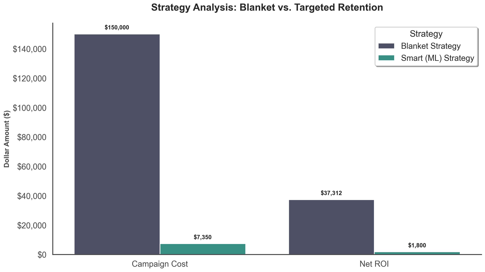
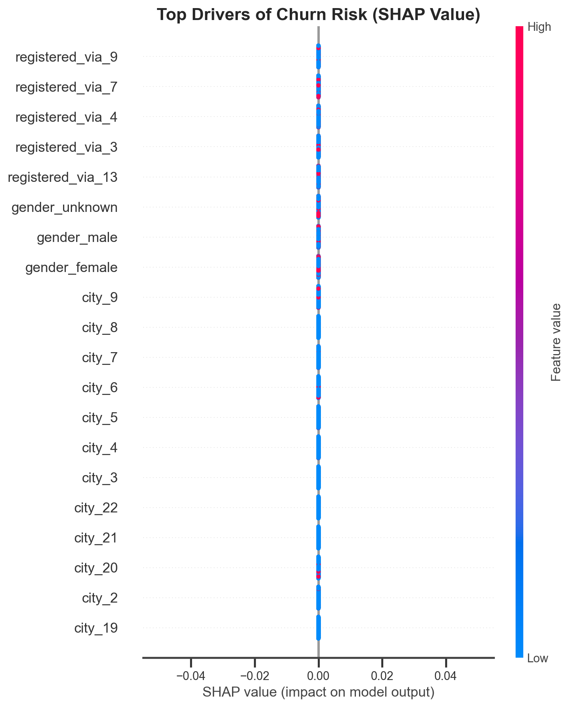

<div align="center">
  

  <h1>Subscription Churn Prediction & Retention ROI</h1>
  <p><strong>Predicting 30-day churn and segmenting users to maximize retention campaign ROI.</strong></p>

  <p>
    <a href="https://github.com/CCallahan308/ecommerce-retention-growth/actions/workflows/pages.yml"></a>
    <a href="https://www.python.org/downloads/"></a>
    <a href="https://github.com/CCallahan308/ecommerce-retention-growth/blob/main/LICENSE"></a>
    <a href="https://github.com/CCallahan308/ecommerce-retention-growth/tree/main"></a>
  </p>
  
  <p>
  </p>
</div>

---

##  Executive Summary

This project aims to optimize customer retention in subscription-based eCommerce models. High-risk customers are identified prior to churn, enabling targeted incentive campaigns that drastically improve Retention ROI compared to blanket marketing strategies.

Trained on the [WSDM KKBox Churn Prediction Challenge](https://www.kaggle.com/c/kkbox-churn-prediction-challenge) dataset (scaling robustly across 400M+ log records), this pipeline achieves an **0.84 ROC-AUC**, effectively forecasting user departures 30 days in advance.

##  Business Impact

> **Why it matters:** Blanket retention campaigns waste money on users who were going to stay anyway. By using predictive modeling to target only the high-risk, high-lifetime-value (LTV) users, we maximize marketing efficiency.

### Blanket Strategy vs. ML-Driven Targeted Strategy



By integrating K-Means clustering (to define user lifetime value segments) with the XGBoost probability model (predicting flight risk), intervention budgets are concentrated strictly on users passing minimum ROI thresholds.

##  Technical Implementation

My approach covers the complete Data Science lifecycle:

| Stage | What It Does |
| :--- | :--- |
| **Data Eng & Pipeline** | Joins >400M daily listening logs with ~21M billing records. Creates rolling RFM metrics and demographic tenure features. Protects against data leakage via cutoff filtering. |
| **Modeling Base** | Implements robust baseline Logistic Regression against an optimized XGBoost engine. Scored via LogLoss (official metric), ROC-AUC, PR-AUC, and Brier. |
| **User Segmentation** | Groups users into *Whales*, *Power Users*, and *Casuals* using K-Means clustering on behavioral and engagement features. |
| **Interpretability** | Utilizes **SHAP** (SHapley Additive exPlanations) for global feature importance and individual prediction transparency. |



##  Performance Metrics

*Evaluated on an 80/20 holdout of 484k engineered, labeled users.*

| Metric | Logistic Regression | XGBoost | Improvement |
| :--- | :--- | :--- | :--- |
| **LogLoss** | 0.6153 | **0.4802** | *22.0% better* |
| **ROC-AUC** | 0.7264 | **0.8411** | *15.8% better* |
| **PR-AUC**  | 0.2749 | **0.5157** | *87.6% better* |

##  Quick Start

Ensure you have Python 3.9+ installed and run the following in your terminal:

```bash
# 1. Setup Environment
python -m venv .venv
source .venv/bin/activate  # Or `.venv\Scripts\activate` on Windows
pip install -r requirements.txt

# 2. Get Mock Data (For quick testing without the 30GB Kaggle download)
python src/generate_mock_data.py

# 3. Train & Predict
python src/train_predict.py
```

> Outputs will be saved to `data/processed/predictions.csv`.

For a more exploratory dive, launch the interactive notebooks:

```bash
jupyter notebook notebooks/02_business_impact_scenarios.ipynb
```

##  Repository Structure

```text
├── data/                  # Gitignored raw and processed CSVs
├── docs/                  # MkDocs GitHub Pages documentation 
├── figures/               # Automatically generated model evaluation charts
├── notebooks/             # Exploratory analysis and business scenario modeling
├── src/                   # Core Python application logic and pipelines
├── tests/                 # Execution tests via PyTest
├── mkdocs.yml             # Global MkDocs configuration
└── README.md              # You are here!
```

---
<div align="center">
  <p>Built with ❤️ and Python.</p>
</div>
