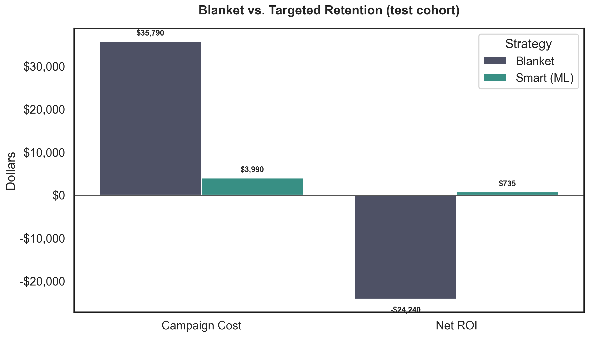

<div align="center">
  <h1>Subscription Churn Prediction & Retention ROI</h1>
  <p><strong>Predicting 30-day churn and segmenting users to maximize retention campaign ROI.</strong></p>

  <p>
    <a href="https://github.com/CCallahan308/ecommerce-retention-growth/actions/workflows/validation.yml"></a>
    <a href="https://www.python.org/downloads/"></a>
    <a href="https://github.com/CCallahan308/ecommerce-retention-growth/blob/main/LICENSE"></a>
    <a href="https://github.com/astral-sh/ruff"></a>
  </p>
  
  <p>
    <a href="https://ccallahan308.github.io/ecommerce-retention-growth/"><strong>Full Documentation</strong></a>
  </p>
</div>

---

## What this does

Predicts which subscription users will churn in the next 30 days, segments them by value, and figures out where retention spend actually pays off.

Built on the WSDM KKBox dataset (400M+ daily logs, 21M billing records). The pipeline trains an XGBoost classifier, clusters users by lifetime value, and runs an ROI simulator to show where marketing budget gets the best return. It also ships a synthetic-data generator so the whole thing runs end-to-end without the 30GB download (used by CI).

## Results

Real **KKBox** data — held-out test split (20%) of a **50,000-user labeled sample**
(seed 42), 43,999 users with features, churn rate 8.9%, feature cutoff 2017-03-01.
Written to [`reports/metrics.json`](reports/metrics.json) on every run; reproduce
with the [real-data steps](#reproduce-the-real-data-run) below.

| Metric  | LR    | XGB   | XGB-cal   |
|:--------|:-----:|:-----:|:---------:|
| ROC-AUC | 0.748 | 0.783 | **0.788** |
| PR-AUC  | 0.265 | 0.412 | **0.416** |
| LogLoss | 0.601 | 0.390 | **0.243** |
| Brier   | 0.198 | 0.123 | **0.067** |

_LR = logistic-regression baseline · XGB = tuned XGBoost · XGB-cal = calibrated (shipped)._

XGBoost beats the logistic-regression baseline on every metric, most clearly on
PR-AUC (+56%) — the metric that matters under class imbalance. Probability
calibration (see below) then cuts LogLoss 0.390 → 0.243 and Brier 0.123 → 0.067
without changing the ranking (ROC-AUC).

> A **50K-user sample** is used because the full 970K-label / ~18M-log dataset
> needs more memory than a typical laptop has free; the sample is fixed-seed and
> the methodology is identical at full scale. Running on a clean clone without
> Kaggle access? `make data && make train` runs the same pipeline on synthetic
> data and writes the same `reports/metrics.json` (with `"source": "synthetic"`).

## How it works

### Validation strategy

A stratified **80/20 train/test split** is held out up front. Hyperparameters are
tuned with stratified **3-fold cross-validation inside the training split** — those
folds are the validation signal, so there is no separate static validation set.
**All reported metrics are on the held-out test split**, which the model never sees
during fitting or tuning.

### Churn model

XGBoost classifier tuned with `RandomizedSearchCV` over tree depth, learning rate,
row subsampling, and estimator count, scored on log-loss. The objective is binary
cross-entropy:

```
L(θ) = -1/N Σ [yᵢ log(p̂ᵢ) + (1-yᵢ) log(1-p̂ᵢ)]
```

**Class imbalance** is handled explicitly: `class_weight="balanced"` for the
baseline, `scale_pos_weight` for XGBoost — which is why PR-AUC, LogLoss, and Brier
are reported instead of accuracy.

### Probability calibration

The ROI simulator multiplies predicted probabilities by lifetime value, so they
must be *calibrated*, not merely well-ranked. The tuned model is wrapped in Platt
scaling (`CalibratedClassifierCV`, refit over CV folds to avoid leakage). On the
synthetic test split this cut **Brier 0.126 → 0.088** and **LogLoss 0.411 → 0.328**.

### Scoring cohort

Both training and scoring are restricted to users **active at the cutoff date**
(subscribed or within the 30-day grace period). Scoring long-dormant users — a
different feature distribution the model never trained on — produces degenerate
near-certain-churn predictions; a built-in KS drift check guards against this.

### User segmentation

K-Means on behavioral + revenue features splits users into:
- **Whales** - high LTV, low churn risk
- **Power Users** - frequent usage, medium value
- **Casuals** - intermittent engagement

This matters because spending $10 to retain a $1000 LTV user makes sense. Spending $10 on someone worth $5 doesn't.

### ROI simulator

Instead of blasting everyone with the same retention offer, the simulator asks: for each segment, what's the expected return on a given intervention cost?

<div align="center">
  
</div>

### Model interpretation

SHAP values show which features drive churn predictions (generated by
`python src/business_impact.py`):

<div align="center">
  
</div>

### Exploratory analysis

`python src/eda.py` regenerates the EDA figures (registration cohorts, transaction
trends, listening-time distribution) in `figures/`.

## Quick start

```bash
# clone and setup
git clone https://github.com/CCallahan308/ecommerce-retention-growth.git
cd ecommerce-retention-growth

uv venv
source .venv/bin/activate  # Windows: .venv\Scripts\activate
uv pip install -e .[dev]

# generate synthetic data (skip the 30GB Kaggle download)
make data

# train, evaluate, calibrate, and write reports/metrics.json
make train

# run tests and lint
make test
make lint
```

Regenerate the analysis figures:

```bash
python src/eda.py             # EDA plots
python src/business_impact.py # confusion matrix, SHAP, ROI comparison
```

## Repo structure

```
├── data/          # raw and processed data + saved model (gitignored)
├── docs/          # MkDocs site
├── figures/       # generated plots
├── reports/       # metrics.json model card (committed, reproducible)
├── src/           # pipeline code
│   ├── config.py          # central constants (seeds, splits, churn window)
│   ├── data_loader.py     # typed loading + cleaning
│   ├── eda.py             # exploratory plots
│   ├── features.py        # cutoff-gated RFM + engagement transformers, labels
│   ├── models.py          # pipeline, training, tuning, calibration, metrics
│   ├── segmentation.py    # K-Means value segments
│   ├── business_impact.py # segments + ROI on a held-out cohort, figures
│   └── train_predict.py   # end-to-end train -> evaluate -> score -> persist
├── tests/         # pytest (leakage, schema, pipeline integration)
├── Makefile
└── pyproject.toml
```

## Data source

WSDM KKBox Churn Prediction Challenge on Kaggle (the `v2` refresh: members,
transactions, user logs, and labels). `make data` generates synthetic data that
flows through the identical pipeline for a no-download run.

### Reproduce the real-data run

Requires Kaggle API credentials and accepting the competition rules once on
Kaggle.com:

```bash
python src/download_real_data.py    # download + extract the v2 files to data/raw/
python src/sample_kaggle_data.py    # fixed-seed 50K-user labeled sample (memory-safe)
make train                          # -> reports/metrics.json with "source": "KKBox v2 (real)"
make figures                        # regenerate EDA + SHAP + ROI plots on real data
```

Skip `sample_kaggle_data.py` to train on the full ~970K-label dataset if you have
the memory (roughly 8–10 GB free).

## Limitations & future work

- **Headline metrics use a fixed-seed 50K-user sample** of the real data, because
  the full 970K-label / ~18M-log dataset needs more RAM than a typical laptop has
  free. The sample is reproducible and the methodology is identical at full scale;
  running the complete dataset is a memory question, not a code one.
- **Tuning is intentionally light** (3 CV folds, 5 search candidates) to keep CI and
  local runs fast; a real run would widen the search space and fold count.
- **The ROI simulator uses illustrative assumptions** (fixed LTV, a 25% save-rate).
  A production readout would source the save-rate from an A/B holdout and LTV from
  finance, not fixed constants.
- **No model registry yet** — the fitted pipeline is persisted to
  `data/processed/model.joblib` with a `reports/metrics.json` card, but versioned
  tracking (MLflow/DVC) is future work, along with isotonic calibration once more
  data is available and SHAP-driven feature iteration.

## Requirements

Python 3.10+ (CI runs and pins 3.11), dependencies in `pyproject.toml`; a fully
pinned environment is in `requirements-lock.txt`. Key packages: XGBoost,
scikit-learn, pandas, SHAP.
