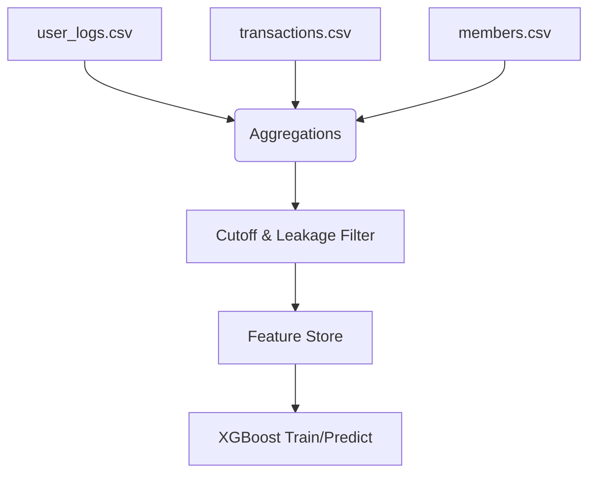

# Data Engineering & Feature Engineering

The pipeline uses the full [WSDM KKBox Churn Prediction Challenge](https://www.kaggle.com/c/kkbox-churn-prediction-challenge) dataset. This dataset is immense and requires careful data engineering to feed our modeling pipeline without introducing data leakage.

## Dataset Volume

| File | Records | Description |
| :--- | ---: | :--- |
| `train.csv` | 970,960 | Official ground-truth churn labels (`msno`, `is_churn`) |
| `members.csv` | 6,769,473 | User demographics (city, age, gender, registration date) |
| `transactions.csv` | ~21M | Billing history (plans, payments, auto-renew, cancellations) |
| `user_logs.csv` | ~400M | Daily listening activity (songs played, listening time) |

## Pipeline Flow

1. **Extraction**: Raw data is unzipped locally or read via the Kaggle API. Note: Due to its sheer volume (30GB+), we implemented a chunked sampling methodology in `src/sample_kaggle_data.py`.
2. **Transform**: We join the `members` demographic data with aggregated metrics from both `transactions` and `user_logs`.
3. **Feature Engineering**:
   - Built a Python port of the original Scala labeler.
   - Designed Recency, Frequency, Monetary (RFM) components from `.csv` billing history.
   - Examined 30/60 day rolling engagement trends from `user_logs`.
4. **Leakage Protection**: Strict cutoff mechanisms were established so that only historical data strictly prior to the label month is used.

### Pipeline Diagram

After extraction and feature engineering, **484,496 labeled users** possessed sufficient activity data for training. An additional **205,338 unlabeled users** receive predictive scoring.
