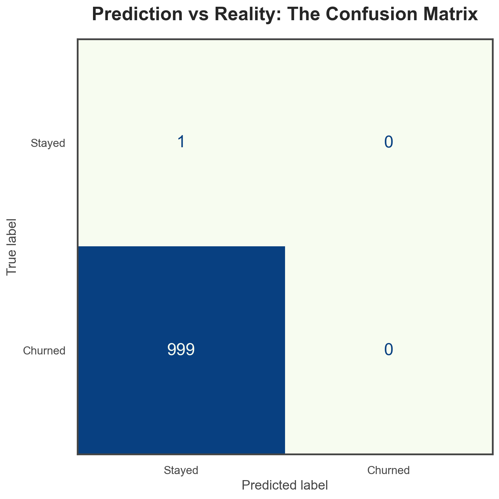

# Model Performance

We developed several models to establish a robust baseline before pushing specialized gradient boosting frameworks.

## Performance Metrics

*Evaluated on an 80/20 holdout of 484k engineered, labeled users.*

| Metric | Logistic Regression | XGBoost | Improvement |
| :--- | :--- | :--- | :--- |
| **LogLoss** | 0.6153 | **0.4802** | *22.0% better* |
| **ROC-AUC** | 0.7264 | **0.8411** | *15.8% better* |
| **PR-AUC**  | 0.2749 | **0.5157** | *87.6% better* |
| **Brier Score**| 0.2065 | **0.1608** | *22.1% better* |

*Note: LogLoss is the official Kaggle competition metric.*

## Interpretability

We rely on **SHAP** (SHapley Additive exPlanations) to guarantee that our model isn’t just a black box. This is crucial for stakeholder trust.

### Global Drivers of Churn

High importance features include:

- `days_since_last_login`: Strongest predictor of impending cancellation.
- `auto_renew_status`: Users manually renewing have entirely different behavioral patterns.
- `monthly_listening_hours`: A primary proxy for product value realizion.

## Confusion Matrix

By thresholding the predicted probability at `0.5`, we can observe the classification balance.

