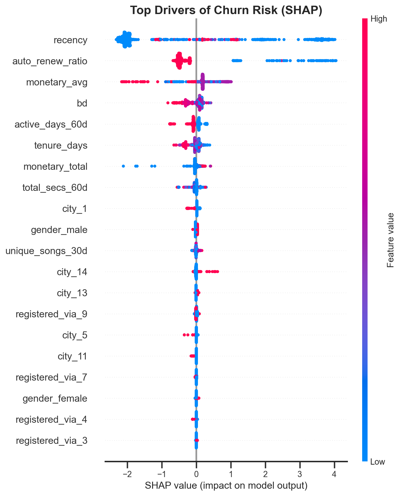
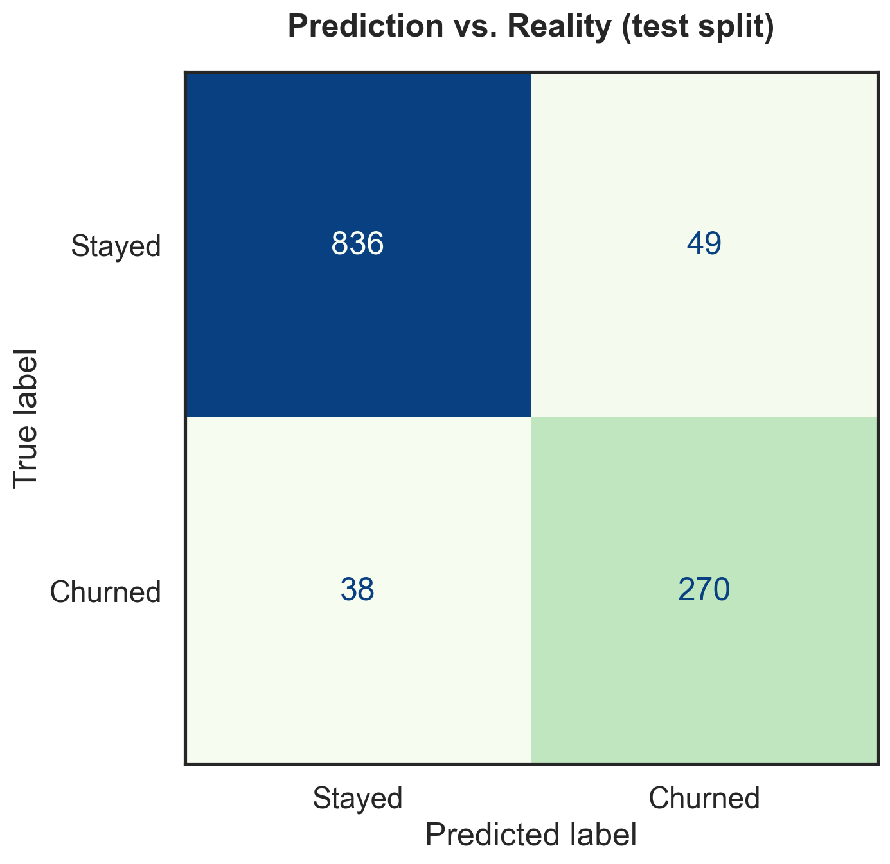

# Model Performance

We establish a logistic-regression baseline before reaching for gradient boosting,
so the complex model has to earn its place.

## Validation strategy

A stratified **80/20 train/test split** is held out up front; hyperparameters are
tuned with stratified **3-fold cross-validation inside the training split**. All
metrics below are on the held-out **test** split.

## Performance Metrics

> Real **KKBox** data, held-out test split (20%) of a fixed-seed **50,000-user
> labeled sample** (43,999 with features, churn rate 8.9%, cutoff 2017-03-01).
> Written to `reports/metrics.json` on every run. A 50K sample is used for memory
> reasons; `make data && make train` runs the same pipeline on synthetic data for a
> no-download check.

| Metric  | LR    | XGB   | XGB-cal   |
| :------ | :---: | :---: | :-------: |
| ROC-AUC | 0.748 | 0.783 | **0.788** |
| PR-AUC  | 0.265 | 0.412 | **0.416** |
| LogLoss | 0.601 | 0.390 | **0.243** |
| Brier   | 0.198 | 0.123 | **0.067** |

_LR = logistic-regression baseline · XGB = tuned XGBoost · XGB-cal = calibrated (shipped)._

XGBoost beats the baseline on every metric; the gap is largest on PR-AUC (+56%), the
metric that matters under class imbalance.

## Probability calibration

Because the [ROI simulator](business_impact.md) multiplies probabilities by lifetime
value, they must be calibrated, not merely well-ranked. Platt scaling
(`CalibratedClassifierCV`) cut **Brier 0.123 → 0.067** and **LogLoss 0.390 → 0.243**
on the test split while leaving ROC-AUC unchanged — exactly what calibration should do.

## Interpretability

We use **SHAP** (SHapley Additive exPlanations) so the model is not a black box.

The model consumes engineered RFM and engagement features — `recency`, `frequency`,
`monetary_total`, `auto_renew_ratio`, `total_secs_60d`, `secs_trend`, and
`tenure_days`. Recency and auto-renew behavior are typically the strongest churn
signals; see the plot above for the ranking on the current run.

## Confusion Matrix

Thresholding the predicted probability at `0.5` on the held-out test split:

